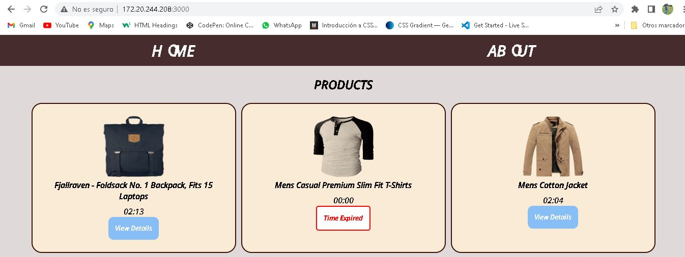
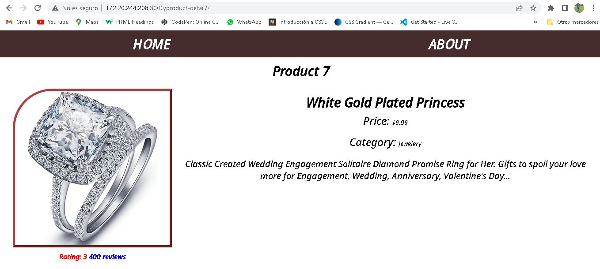

# Assesment Frontend

# PARTE 1

Esta es una solución al proyecto **Assesment Frontend** del curso Make It Real.

## Tabla de contenido

- [Assesment Frontend](#Assesment Frontend)
  - [Tabla de contenido](#tabla-de-contenido)
  - [Resumen](#resumen)
    - [El reto](#el-reto)
    - [Captura de pantalla](#captura-de-pantalla)
    - [Construido con](#construido-con)
    - [Lo que aprendí](#lo-que-aprendí)
    - [Desarrollo continuo](#desarrollo-continuo)
  - [Autor](#autor)

## Resumen

El objetivo de esta misión es poner en práctica lo que has aprendido en el programa. Los temas que se cubrirán son: Scrum, Git, HTML y CSS, JavaScript y React.

La misión consta de dos partes: primero deberás construir un proyecto en React y después deberás responder una serie de preguntas. En el reporte de la misión deberás agregar el link al repositorio del proyecto y las respuestas a las preguntas.

### El reto

Construir una aplicación web la cual consta de tres páginas:

Home
Product Detail
About
La aplicación debe tener un menú que le permita al usuario navegar entre estas páginas.

Requerimientos
Usar Flexbox CSS.
El proyecto debe tener configurado ESLint y que tus archivos no tengan problemas con estos.
El código del proyecto debe estar en un repositorio público de tu autoría.
Bonus: Implementar tu CSS con BEM o módulos de CSS.

### Captura de pantalla

### Construido con

- React
- Axios
- Redux
- Lenguaje JSX
- CSS Module 

### Lo que aprendí

- Manejo de React

### Desarrollo continuo

Profundizar en React, axios y redux

## Autor

- Oscar Nuñez

 # PARTE 2

# ¿Cuáles son las ceremonias más importantes de un Sprint y cuál es la idea de cada una?
  Las ceremonias más importantes de un Sprint son:
Sprint Planning: En esta reunión, el equipo de desarrollo decide qué elementos del Product Backlog se incluirán en el próximo Sprint y cómo se abordarán.
Daily Scrum: Esta es una reunión diaria corta en la que el equipo revisa el progreso del trabajo y planea el trabajo del día.
Sprint Review: Al final del Sprint, el equipo de desarrollo presenta su trabajo al dueño del producto y a los stakeholders.
Sprint Retrospective: Esta reunión tiene como objetivo identificar qué salió bien y qué se puede mejorar en el próximo Sprint.

# ¿Qué son los Wireframes? Nombra al menos una herramienta que podamos utilizar
  Los wireframes son representaciones visuales básicas de una página web o aplicación móvil. Se utilizan para planificar y visualizar la estructura y el diseño de la interfaz de usuario. Algunas herramientas populares para crear wireframes son Figma, Sketch y Adobe XD.

# Explicar la diferencia entre var, let y const. Y dar un ejemplo en qué caso se utilizará.
  var, let y const son palabras clave utilizadas en JavaScript para declarar variables. La diferencia principal es cómo manejan el alcance de la variable y si se permite o no la reasignación de valores.

var tiene alcance de función y permite la reasignación de valores.
let tiene alcance de bloque y también permite la reasignación de valores.
const tiene alcance de bloque y no permite la reasignación de valores.

 # ¿Cuáles son los tres comandos que se pueden utilizar para crear una nueva rama llamada rama-1?
  Los tres comandos que se pueden utilizar para crear una nueva rama llamada rama-1 son:
git branch rama-1
git checkout -b rama-1
git switch -c rama-1

# Explicar la diferencia entre git merge y git rebase
  La diferencia entre git merge y git rebase es que:
git merge fusiona una rama en otra y crea un nuevo commit de fusión que combina el historial de ambas ramas.
git rebase toma los cambios de una rama y los aplica sobre otra rama, lo que resulta en un historial lineal y más limpio.

# ¿Cuál es la diferencia entre Pull Request (PR) y el comando git pull?
  Git pull es un comando que se utiliza para actualizar una rama local con los cambios de una rama remota. En cambio, un Pull Request (PR) es una solicitud que un colaborador del repositorio envía al propietario del repositorio para incluir sus cambios en la rama principal del repositorio.

# ¿Qué es el Virtual DOM?
  El Virtual DOM es una representación virtual en memoria del DOM (Document Object Model) de una página web. Permite a las bibliotecas y frameworks de JavaScript como React, actualizar la interfaz de usuario de manera eficiente al minimizar las actualizaciones del DOM real.

# CodePem
  [Codepen](https://codepen.io/Oskarnuz/pen/RwYqWdN)

